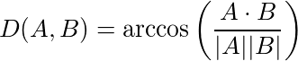
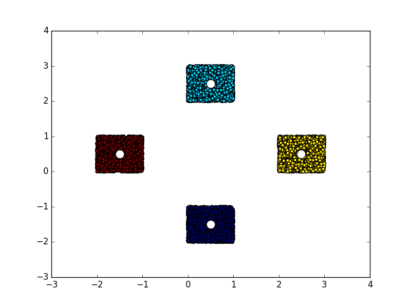
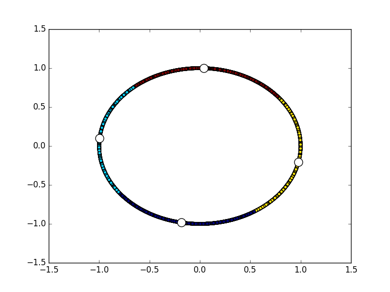

[](https://travis-ci.org/src-d/kmcuda) [](https://pypi.python.org/pypi/libKMCUDA) [](https://doi.org/10.5281/zenodo.286944)

"Yinyang" K-means and K-nn using NVIDIA CUDA
============================================

K-means implementation is based on ["Yinyang K-Means: A Drop-In Replacement
of the Classic K-Means with Consistent Speedup"](https://www.microsoft.com/en-us/research/wp-content/uploads/2016/02/ding15.pdf). While it introduces some overhead and many conditional clauses
which are bad for CUDA, it still shows 1.6-2x speedup against the Lloyd
algorithm. K-nearest neighbors employ the same triangle inequality idea and
require precalculated centroids and cluster assignments, similar to the flattened
ball tree.

| [Benchmarks](#benchmarks) | sklearn KMeans | KMeansRex | KMeansRex OpenMP | Serban | kmcuda | kmcuda 2 GPUs |
|---------------------------|----------------|-----------|------------------|--------|--------|---------------|
| speed                     | 1x             | 4.5x      | 8.2x             | 15.5x  | 17.8x  | 29.8x         |
| memory                    | 1x             | 2x        | 2x               | 0.6x   | 0.6x   | 0.6x          |

Technically, this project is a shared library which exports two functions
defined in `kmcuda.h`: `kmeans_cuda` and `knn_cuda`.
It has built-in Python3 and R native extension support, so you can
`from libKMCUDA import kmeans_cuda` or `dyn.load("libKMCUDA.so")`.

[](http://sourced.tech)
<p align="right"><a href="img/kmeans_image.ipynb">How was this created?</a></p>

Table of contents
-----------------
* [K-means](#k-means)
* [K-nn](#k-nn)
* [Notes](#notes)
* [Building](#building)
   * [macOS](#macos)
* [Testing](#testing)
* [Benchmarks](#benchmarks)
   * [100,000x256@1024](#100000x2561024)
      * [Configuration](#configuration)
      * [Contestants](#contestants)
      * [Data](#data)
      * [Notes](#notes-1)
   * [8,000,000x256@1024](#8000000x2561024)
      * [Data](#data-1)
      * [Notes](#notes-2)
* [Python examples](#python-examples)
   * [K-means, L2 (Euclidean) distance](#k-means-l2-euclidean-distance)
   * [K-means, angular (cosine) distance + average](#k-means-angular-cosine-distance--average)
   * [K-nn](#k-nn-1)
* [Python API](#python-api)
* [R examples](#r-examples)
   * [K-means](#k-means-1)
   * [K-nn](#k-nn-2)
* [R API](#r-api)
* [C examples](#c-examples)
* [C API](#c-api)
* [License](#license)

K-means
-------
The major difference between this project and others is that kmcuda is
optimized for low memory consumption and the large number of clusters. E.g.,
kmcuda can sort 4M samples in 480 dimensions into 40000 clusters (if you
have several days and 12 GB of GPU memory); 300K samples are grouped
into 5000 clusters in 4½ minutes on NVIDIA Titan X (15 iterations); 3M samples
and 1000 clusters take 20 minutes (33 iterations). Yinyang can be
turned off to save GPU memory but the slower Lloyd will be used then.
Four centroid initialization schemes are supported: random, k-means++,
[AFKMC2](http://olivierbachem.ch/files/afkmcmc-oral-pdf.pdf) and import.
Two distance metrics are supported: L2 (the usual one) and angular
(arccos of the scalar product). L1 is in development.
16-bit float support delivers 2x memory compression. If you've got several GPUs,
they can be utilized together and it gives the corresponding linear speedup
either for Lloyd or Yinyang.

The code has been thoroughly tested to yield bit-to-bit identical
results from Yinyang and Lloyd. "Fast and Provably Good Seedings for k-Means" was adapted from
[the reference code](https://github.com/obachem/kmc2).

Read the articles: [1](http://blog.sourced.tech/post/towards_kmeans_on_gpu/),
[2](https://blog.sourced.tech/post/kmcuda4/).

K-nn
----
Centroid distance matrix C<sub>ij</sub> is calculated together with clusters'
radiuses R<sub>i</sub> (the maximum distance from the centroid to the corresponding
cluster's members). Given sample S in cluster A, we avoid calculating the distances from S
to another cluster B's members if C<sub>AB</sub> - SA - R<sub>B</sub> is greater
than the current maximum K-nn distance. This resembles the [ball tree
algorithm](http://scikit-learn.org/stable/modules/neighbors.html#ball-tree).

The implemented algorithm is tolerant to NANs. There are two variants depending
on whether k is small enough to fit the sample's neighbors into CUDA shared memory.
Internally, the neighbors list is a [binary heap](https://en.wikipedia.org/wiki/Binary_heap) -
that reduces the complexity multiplier from O(k) to O(log k).

The implementation yields identical results to `sklearn.neighbors.NearestNeighbors`
except cases in which adjacent distances are equal and the order is undefined.
That is, the returned indices are sorted in the increasing order of the
corresponding distances.

Notes
-----
Lloyd is tolerant to samples with NaN features while Yinyang is not.
It may happen that some of the resulting clusters contain zero elements.
In such cases, their features are set to NaN.

Angular (cosine) distance metric effectively results in Spherical K-Means behavior.
The samples **must** be normalized to L2 norm equal to 1 before clustering,
it is not done automatically. The actual formula is:



If you get OOM with the default parameters, set `yinyang_t` to 0 which
forces Lloyd. `verbosity` 2 will print the memory allocation statistics
(all GPU allocation happens at startup).

Data type is either 32- or 16-bit float. Number of samples is limited by 2^32,
clusters by 2^32 and features by 2^16 (2^17 for fp16). Besides, the product of
clusters number and features number may not exceed 2^32.

In the case of 16-bit floats, the reduced precision often leads to a slightly
increased number of iterations, Yinyang is especially sensitive to that.
In some cases, there may be overflows and the clustering may fail completely.

Building
--------
```
cmake -DCMAKE_BUILD_TYPE=Release . && make
```
It requires cudart 8.0 / Pascal and OpenMP 4.0 capable compiler. The build has
been tested primarily on Linux but it works on macOS too with some blows and whistles
(see "macOS" subsection).
If you do not want to build the Python native module, add `-D DISABLE_PYTHON=y`.
If you do not want to build the R native module, add `-D DISABLE_R=y`.
If CUDA is not automatically found, add `-D CUDA_TOOLKIT_ROOT_DIR=/usr/local/cuda-8.0`
(change the path to the actual one). By default, CUDA kernels are compiled for
the architecture 60 (Pascal). It is possible to override it via `-D CUDA_ARCH=52`,
but fp16 support will be disabled then.

Python users: if you are using Linux x86-64 and CUDA 8.0, then you can
install libKMCUDA easily:
```
pip install libKMCUDA
```
Otherwise, you'll have to install it from source:
```
pip install git+https://github.com/src-d/kmcuda.git#subdirectory=src
```

#### macOS
Install [Homebrew](http://brew.sh/) and the [Command Line Developer Tools](https://developer.apple.com/download/more/)
which are compatible with your CUDA installation. E.g., CUDA 8.0 does not support
the latest 8.x and works with 7.3.1 and below. Install `clang` with OpenMP support
and Python with numpy:
```
brew install llvm --with-clang
brew install python3
pip3 install numpy
```
Execute this magic command which builds kmcuda afterwards:
```
CC=/usr/local/opt/llvm/bin/clang CXX=/usr/local/opt/llvm/bin/clang++ LDFLAGS=-L/usr/local/opt/llvm/lib/ cmake -DCMAKE_BUILD_TYPE=Release .
```
And make the last important step - rename \*.dylib to \*.so so that Python is able to import the native extension:
```
mv libKMCUDA.{dylib,so}
```

Testing
-------
`test.py` contains the unit tests based on [unittest](https://docs.python.org/3/library/unittest.html).
They require either [cuda4py](https://github.com/ajkxyz/cuda4py) or [pycuda](https://github.com/inducer/pycuda) and
[scikit-learn](http://scikit-learn.org/stable/).
`test.R` contains R integration tests and shall be run with `Rscript`.

Benchmarks
----------

### 100000x256@1024
|            | sklearn KMeans | KMeansRex | KMeansRex OpenMP | Serban | kmcuda | kmcuda 2 GPUs |
|------------|----------------|-----------|------------------|--------|--------|---------------|
| time, s    | 164            | 36        | 20               | 10.6   | 9.2    | 5.5           |
| memory, GB | 1              | 2         | 2                | 0.6    | 0.6    | 0.6           |

#### Configuration
* 16-core (32 threads) Intel Xeon E5-2620 v4 @ 2.10GHz
* 256 GB RAM Samsung M393A2K40BB1
* Nvidia Titan X 2016

#### Contestants
* [sklearn.cluster.KMeans](http://scikit-learn.org/stable/modules/generated/sklearn.cluster.KMeans.html)@0.18.1; `KMeans(n_clusters=1024, init="random", max_iter=15, random_state=0, n_jobs=1, n_init=1)`.
* [KMeansRex](https://github.com/michaelchughes/KMeansRex)@288c40a with `-march-native` and Eigen 3.3; `KMeansRex.RunKMeans(data, 1024, Niter=15, initname=b"random")`.
* KMeansRex with additional `-fopenmp`.
* [Serban KMeans](https://github.com/serban/kmeans)@83e76bf built for arch 6.1; `./cuda_main  -b -i serban.bin -n 1024 -t 0.0028 -o`
* kmcuda v6.1 built for arch 6.1; `libKMCUDA.kmeans_cuda(dataset, 1024, tolerance=0.002, seed=777, init="random", verbosity=2, yinyang_t=0, device=0)`
* kmcuda running on 2 GPUs.

#### Data
100000 random samples uniformly distributed between 0 and 1 in 256 dimensions.

#### Notes
100000 is the maximum size Serban KMeans can handle.

### 8000000x256@1024
|            | sklearn KMeans | KMeansRex | KMeansRex OpenMP | Serban | kmcuda 2 GPU | kmcuda Yinyang 2 GPUs |
|------------|----------------|-----------|------------------|--------|--------------|-----------------------|
| time       | please no      | -         | 6h 34m           | fail   | 44m          | 36m                   |
| memory, GB | -              | -         | 205              | fail   | 8.7          | 10.4                  |

kmeans++ initialization, 93 iterations (1% reassignments equivalent).

#### Data
8,000,000 secret production samples.

#### Notes
KmeansRex did eat 205 GB of RAM on peak; it uses dynamic memory so it constantly
bounced from 100 GB to 200 GB.

Python examples
---------------

#### K-means, L2 (Euclidean) distance

```python
import numpy
from matplotlib import pyplot
from libKMCUDA import kmeans_cuda

numpy.random.seed(0)
arr = numpy.empty((10000, 2), dtype=numpy.float32)
arr[:2500] = numpy.random.rand(2500, 2) + [0, 2]
arr[2500:5000] = numpy.random.rand(2500, 2) - [0, 2]
arr[5000:7500] = numpy.random.rand(2500, 2) + [2, 0]
arr[7500:] = numpy.random.rand(2500, 2) - [2, 0]
centroids, assignments = kmeans_cuda(arr, 4, verbosity=1, seed=3)
print(centroids)
pyplot.scatter(arr[:, 0], arr[:, 1], c=assignments)
pyplot.scatter(centroids[:, 0], centroids[:, 1], c="white", s=150)
```
You should see something like this:


#### K-means, angular (cosine) distance + average

```python
import numpy
from matplotlib import pyplot
from libKMCUDA import kmeans_cuda

numpy.random.seed(0)
arr = numpy.empty((10000, 2), dtype=numpy.float32)
angs = numpy.random.rand(10000) * 2 * numpy.pi
for i in range(10000):
    arr[i] = numpy.sin(angs[i]), numpy.cos(angs[i])
centroids, assignments, avg_distance = kmeans_cuda(
    arr, 4, metric="cos", verbosity=1, seed=3, average_distance=True)
print("Average distance between centroids and members:", avg_distance)
print(centroids)
pyplot.scatter(arr[:, 0], arr[:, 1], c=assignments)
pyplot.scatter(centroids[:, 0], centroids[:, 1], c="white", s=150)
```
You should see something like this:


#### K-nn

```python
import numpy
from libKMCUDA import kmeans_cuda, knn_cuda

numpy.random.seed(0)
arr = numpy.empty((10000, 2), dtype=numpy.float32)
angs = numpy.random.rand(10000) * 2 * numpy.pi
for i in range(10000):
    arr[i] = numpy.sin(angs[i]), numpy.cos(angs[i])
ca = kmeans_cuda(arr, 4, metric="cos", verbosity=1, seed=3)
neighbors = knn_cuda(10, arr, *ca, metric="cos", verbosity=1, device=1)
print(neighbors[0])
```
You should see
```
reassignments threshold: 100
performing kmeans++...
done
too few clusters for this yinyang_t => Lloyd
iteration 1: 10000 reassignments
iteration 2: 926 reassignments
iteration 3: 416 reassignments
iteration 4: 187 reassignments
iteration 5: 87 reassignments
initializing the inverse assignments...
calculating the cluster radiuses...
calculating the centroid distance matrix...
searching for the nearest neighbors...
calculated 0.276552 of all the distances
[1279 1206 9846 9886 9412 9823 7019 7075 6453 8933]
```

Python API
----------
```python
def kmeans_cuda(samples, clusters, tolerance=0.01, init="k-means++",
                yinyang_t=0.1, metric="L2", average_distance=False,
                seed=time(), device=0, verbosity=0)
```
**samples** numpy array of shape \[number of samples, number of features\]
            or tuple(raw device pointer (int), device index (int), shape (tuple(number of samples, number of features\[, fp16x2 marker\]))).
            In the latter case, negative device index means host pointer. Optionally,
            the tuple can be 2 items longer with preallocated device pointers for
            centroids and assignments. dtype must be either float16 or
            convertible to float32.

**clusters** integer, the number of clusters.

**tolerance** float, if the relative number of reassignments drops below this value,
              algorithm stops.

**init** string or numpy array, sets the method for centroids initialization,
         may be "k-means++", "afk-mc2", "random" or numpy array of shape
         \[**clusters**, number of features\]. dtype must be float32.

**yinyang_t** float, the relative number of cluster groups, usually 0.1.
              0 disables Yinyang refinement.

**metric** str, the name of the distance metric to use. The default is Euclidean (L2),
           it can be changed to "cos" to change the algorithm to Spherical K-means
           with the angular distance. Please note that samples *must* be normalized
           in the latter case.

**average_distance** boolean, the value indicating whether to calculate
                     the average distance between cluster elements and
                     the corresponding centroids. Useful for finding
                     the best K. Returned as the third tuple element.

**seed** integer, random generator seed for reproducible results.

**device** integer, bitwise OR-ed CUDA device indices, e.g. 1 means first device,
           2 means second device, 3 means using first and second device. Special
           value 0 enables all available devices. The default is 0.

**verbosity** integer, 0 means complete silence, 1 means mere progress logging,
              2 means lots of output.

**return** tuple(centroids, assignments, \[average_distance\]).
           If **samples** was a numpy array or a host pointer tuple, the types
           are numpy arrays, otherwise, raw pointers (integers) allocated on the
           same device. If **samples** are float16, the returned centroids are
           float16 too.

```python
def knn_cuda(k, samples, centroids, assignments, metric="L2", device=0, verbosity=0)
```
**k** integer, the number of neighbors to search for each sample. Must be ≤ 1<sup>16</sup>.

**samples** numpy array of shape \[number of samples, number of features\]
            or tuple(raw device pointer (int), device index (int), shape (tuple(number of samples, number of features\[, fp16x2 marker\]))).
            In the latter case, negative device index means host pointer. Optionally,
            the tuple can be 1 item longer with the preallocated device pointer for
            neighbors. dtype must be either float16 or convertible to float32.

**centroids** numpy array with precalculated clusters' centroids (e.g., using
              K-means/kmcuda/kmeans_cuda()). dtype must match **samples**.
              If **samples** is a tuple then **centroids** must be a length-2
              tuple, the first element is the pointer and the second is the
              number of clusters. The shape is (number of clusters, number of features).

**assignments** numpy array with sample-cluster associations. dtype is expected
                to be compatible with uint32. If **samples** is a tuple then
                **assignments** is a pointer. The shape is (number of samples,).

**metric** str, the name of the distance metric to use. The default is Euclidean (L2),
           it can be changed to "cos" to change the algorithm to Spherical K-means
           with the angular distance. Please note that samples *must* be normalized
           in the latter case.

**device** integer, bitwise OR-ed CUDA device indices, e.g. 1 means first device,
           2 means second device, 3 means using first and second device. Special
           value 0 enables all available devices. The default is 0.

**verbosity** integer, 0 means complete silence, 1 means mere progress logging,
              2 means lots of output.

**return** neighbor indices. If **samples** was a numpy array or
            a host pointer tuple, the return type is numpy array, otherwise, a
            raw pointer (integer) allocated on the same device. The shape is
            (number of samples, k).

R examples
----------
#### K-means
```R
dyn.load("libKMCUDA.so")
samples = replicate(4, runif(16000))
result = .External("kmeans_cuda", samples, 50, tolerance=0.01,
                   seed=777, verbosity=1, average_distance=TRUE)
print(result$average_distance)
print(result$centroids[1:10,])
print(result$assignments[1:10])
```

#### K-nn
```R
dyn.load("libKMCUDA.so")
samples = replicate(4, runif(16000))
cls = .External("kmeans_cuda", samples, 50, tolerance=0.01,
                seed=777, verbosity=1)
result = .External("knn_cuda", 20, samples, cls$centroids, cls$assignments,
                   verbosity=1)
print(result[1:10,])
```

R API
-----
```R
function kmeans_cuda(
    samples, clusters, tolerance=0.01, init="k-means++", yinyang_t=0.1,
    metric="L2", average_distance=FALSE, seed=Sys.time(), device=0, verbosity=0)
```
**samples** real matrix of shape \[number of samples, number of features\]
            or list of real matrices which are rbind()-ed internally. No more
            than INT32_MAX samples and UINT16_MAX features are supported.

**clusters** integer, the number of clusters.

**tolerance** real, if the relative number of reassignments drops below this value,
              algorithm stops.

**init** character vector or real matrix, sets the method for centroids initialization,
         may be "k-means++", "afk-mc2", "random" or real matrix, of shape
         \[**clusters**, number of features\].

**yinyang_t** real, the relative number of cluster groups, usually 0.1.
              0 disables Yinyang refinement.

**metric** character vector, the name of the distance metric to use. The default
           is Euclidean (L2), it can be changed to "cos" to change the algorithm
           to Spherical K-means with the angular distance. Please note that
           samples *must* be normalized in the latter case.

**average_distance** logical, the value indicating whether to calculate
                     the average distance between cluster elements and
                     the corresponding centroids. Useful for finding
                     the best K. Returned as the third list element.

**seed** integer, random generator seed for reproducible results.

**device** integer, bitwise OR-ed CUDA device indices, e.g. 1 means first device,
           2 means second device, 3 means using first and second device. Special
           value 0 enables all available devices. The default is 0.

**verbosity** integer, 0 means complete silence, 1 means mere progress logging,
              2 means lots of output.

**return** list(centroids, assignments\[, average_distance\]). Indices in
           assignments start from 1.

```R
function knn_cuda(k, samples, centroids, assignments, metric="L2", device=0, verbosity=0)
```
**k** integer, the number of neighbors to search for each sample. Must be ≤ 1<sup>16</sup>.

**samples** real matrix of shape \[number of samples, number of features\]
            or list of real matrices which are rbind()-ed internally.
            In the latter case, is is possible to pass in more than INT32_MAX
            samples.

**centroids** real matrix with precalculated clusters' centroids (e.g., using
              kmeans() or kmeans_cuda()).

**assignments** integer vector with sample-cluster associations. Indices start
                from 1.

**metric** str, the name of the distance metric to use. The default is Euclidean (L2),
                can be changed to "cos" to behave as Spherical K-means with the
                angular distance. Please note that samples *must* be normalized in that
                case.

**device** integer, bitwise OR-ed CUDA device indices, e.g. 1 means first device, 2 means second device,
           3 means using first and second device. Special value 0 enables all available devices.
           The default is 0.

**verbosity** integer, 0 means complete silence, 1 means mere progress logging,
              2 means lots of output.

**return** integer matrix with neighbor indices. The shape is (number of samples, k).
           Indices start from 1.

C examples
----------
`example.c`:
```C
#include <assert.h>
#include <stdint.h>
#include <stdio.h>
#include <stdlib.h>
#include <kmcuda.h>

// ./example /path/to/data <number of clusters>
int main(int argc, const char **argv) {
  assert(argc == 3);
  // we open the binary file with the data
  // [samples_size][features_size][samples_size x features_size]
  FILE *fin = fopen(argv[1], "rb");
  assert(fin);
  uint32_t samples_size, features_size;
  assert(fread(&samples_size, sizeof(samples_size), 1, fin) == 1);
  assert(fread(&features_size, sizeof(features_size), 1, fin) == 1);
  uint64_t total_size = ((uint64_t)samples_size) * features_size;
  float *samples = malloc(total_size * sizeof(float));
  assert(samples);
  assert(fread(samples, sizeof(float), total_size, fin) == total_size);
  fclose(fin);
  int clusters_size = atoi(argv[2]);
  // we will store cluster centers here
  float *centroids = malloc(clusters_size * features_size * sizeof(float));
  assert(centroids);
  // we will store assignments of every sample here
  uint32_t *assignments = malloc(((uint64_t)samples_size) * sizeof(uint32_t));
  assert(assignments);
  float average_distance;
  KMCUDAResult result = kmeans_cuda(
      kmcudaInitMethodPlusPlus, NULL,  // kmeans++ centroids initialization
      0.01,                            // less than 1% of the samples are reassigned in the end
      0.1,                             // activate Yinyang refinement with 0.1 threshold
      kmcudaDistanceMetricL2,          // Euclidean distance
      samples_size, features_size, clusters_size,
      0xDEADBEEF,                      // random generator seed
      0,                               // use all available CUDA devices
      -1,                              // samples are supplied from host
      0,                               // not in float16x2 mode
      1,                               // moderate verbosity
      samples, centroids, assignments, &average_distance);
  free(samples);
  free(centroids);
  free(assignments);
  assert(result == kmcudaSuccess);
  printf("Average distance between a centroid and the corresponding "
         "cluster members: %f\n", average_distance);
  return 0;
}
```
Build:
```
gcc -std=c99 -O2 example.c -I/path/to/kmcuda.h/dir -L/path/to/libKMCUDA.so/dir -l KMCUDA -Wl,-rpath,. -o example
```
Run:
```
./example serban.bin 1024
```
The file format is the same as in [serban/kmeans](https://github.com/serban/kmeans/blob/master/README#L113).

C API
-----
```C
KMCUDAResult kmeans_cuda(
    KMCUDAInitMethod init, float tolerance, float yinyang_t,
    KMCUDADistanceMetric metric, uint32_t samples_size, uint16_t features_size,
    uint32_t clusters_size, uint32_t seed, uint32_t device, int32_t device_ptrs,
    int32_t fp16x2, int32_t verbosity, const float *samples, float *centroids,
    uint32_t *assignments, float *average_distance)
```
**init** specifies the centroids initialization method: k-means++, random or import
         (in the latter case, **centroids** is read).

**tolerance** if the number of reassignments drop below this ratio, stop.

**yinyang_t** the relative number of cluster groups, usually 0.1.

**metric** The distance metric to use. The default is Euclidean (L2), can be
           changed to cosine to behave as Spherical K-means with the angular
           distance. Please note that samples *must* be normalized in that case.

**samples_size** number of samples.

**features_size** number of features. if fp16x2 is set, one half of the number of features.

**clusters_size** number of clusters.

**seed** random generator seed passed to srand().

**device** CUDA device OR-ed indices - usually 1. For example, 1 means using first device,
           2 means second device, 3 means first and second device (2x speedup). Special
           value 0 enables all available devices.

**device_ptrs** configures the location of input and output. If it is negative,
                samples and returned arrays are on host, otherwise, they belong to the
                corresponding device. E.g., if device_ptrs is 0, **samples** is expected
                to be a pointer to device #0's memory and the resulting **centroids** and
                **assignments** are expected to be preallocated on device #0 as well.
                Usually this value is -1.

**fp16x2** activates fp16 mode, two half-floats are packed into a single 32-bit float,
           features_size becomes effectively 2 times bigger, the returned
           centroids are fp16x2 too.

**verbosity** 0 - no output; 1 - progress output; >=2 - debug output.

**samples** input array of size samples_size x features_size in row major format.

**centroids** output array of centroids of size clusters_size x features_size
              in row major format.

**assignments** output array of cluster indices for each sample of size
                samples_size x 1.

**average_distance** output mean distance between cluster elements and
                     the corresponding centroids. If nullptr, not calculated.

Returns KMCUDAResult (see `kmcuda.h`);

```C
KMCUDAResult knn_cuda(
    uint16_t k, KMCUDADistanceMetric metric, uint32_t samples_size,
    uint16_t features_size, uint32_t clusters_size, uint32_t device,
    int32_t device_ptrs, int32_t fp16x2, int32_t verbosity,
    const float *samples, const float *centroids, const uint32_t *assignments,
    uint32_t *neighbors);
```
**k** integer, the number of neighbors to search for each sample.

**metric** The distance metric to use. The default is Euclidean (L2), can be
           changed to cosine to behave as Spherical K-means with the angular
           distance. Please note that samples *must* be normalized in that case.

**samples_size** number of samples.

**features_size** number of features. if fp16x2 is set, one half of the number of features.

**clusters_size** number of clusters.

**device** CUDA device OR-ed indices - usually 1. For example, 1 means using first device,
           2 means second device, 3 means first and second device (2x speedup). Special
           value 0 enables all available devices.

**device_ptrs** configures the location of input and output. If it is negative,
                samples, centroids, assignments and the returned array are on host,
                otherwise, they belong to the corresponding device.
                E.g., if device_ptrs is 0, **samples**, **centroids** and
                **assignments** are expected to be pointers to device #0's memory
                and the resulting **neighbors** is expected to be preallocated on
                device #0 as well. Usually this value is -1.

**fp16x2** activates fp16 mode, two half-floats are packed into a single 32-bit float,
           features_size becomes effectively 2 times bigger, affects **samples**
           and **centroids**.

**verbosity** 0 - no output; 1 - progress output; >=2 - debug output.

**samples** input array of size samples_size x features_size in row major format.

**centroids** input array of centroids of size clusters_size x features_size
              in row major format.

**assignments** input array of cluster indices for each sample of size
                samples_size x 1.

**neighbors** output array with the nearest neighbors of size
              samples_size x k in row major format.

Returns KMCUDAResult (see `kmcuda.h`);

License
-------
MIT license.
